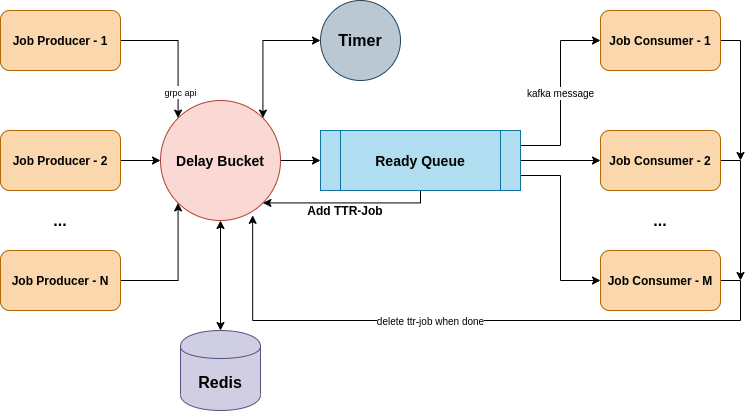

# Delay Queue

Redis-based delay queue is designed to provide message queue with delay-job-distribution.

 

## Get Started

### Prerequisites

```text
1. debian/ubuntu linux/x86-64 release
2. go1.12.7 linux/amd64 or higher
```

### Installation

#### Clone

* Clone this repo to your local machine using https://github.com/usherasnick/Delay-Queue.git.

#### Setup

```shell
make build

./Delay-Queue --conf=conf/delay_queue.json --verbose=true
```

## Reference

* [有赞延迟队列设计](https://tech.youzan.com/queuing_delay/)

## Contribution

### Step 1

* 🍴 Fork this repo!

### Step 2

* 🔨 HACK AWAY!

### Step 3

* 🔃 Create a new PR using https://github.com/usherasnick/Delay-Queue/compare!

## License

* This project is licensed under the MIT License - see the **[MIT license](http://opensource.org/licenses/mit-license.php)** for details
